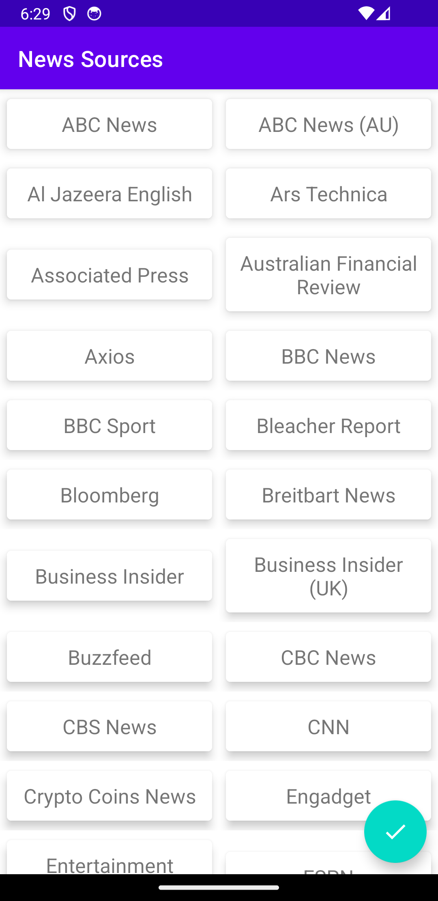

# NewsApp

## Description

NewsApp is an Android application focusing on providing news articles to users. This project emphasizes **MVVM architecture** and **Hilt Dependency Injection** for efficient and maintainable code. It utilizes **Kotlin** as the primary language and incorporates libraries like **Retrofit** for network calls and **Navigation graph** for navigation between screens.

### Technologies Used:

- **Kotlin**
- **Retrofit**
- **Navigation Graph**
- **Hilt Dependency Injection**
- **MVVM**

NewsApp fetches news sources from an API and displays them to the users. Users can then select a news source to view the top headlines from that source on the next screen.

## Screenshots

 

## Table of Contents

- [Installation](#installation)
- [Usage](#usage)
- [Contributing](#contributing)
- [License](#license)

## Installation

1. Clone the repository:
git clone https://github.com/rahulgothwal5/NewsApp.git

2. Open the project in Android Studio.

## Usage

Explore the codebase to learn how to develop an Android application following **MVVM architecture** and utilizing **Hilt Dependency Injection** for managing dependencies. Make use of **Retrofit** for fetching news sources from the API and **Navigation graph** for seamless navigation between screens. Users can select a news source to view the top headlines from that source on the next screen.

## Contributing

1. Fork the repository.
2. Create a new branch (`git checkout -b feature/your-feature-name`).
3. Make your changes.
4. Commit your changes (`git commit -am 'Add new feature'`).
5. Push to the branch (`git push origin feature/your-feature-name`).
6. Create a new Pull Request.

## License

This project is licensed under the [MIT License](LICENSE).
